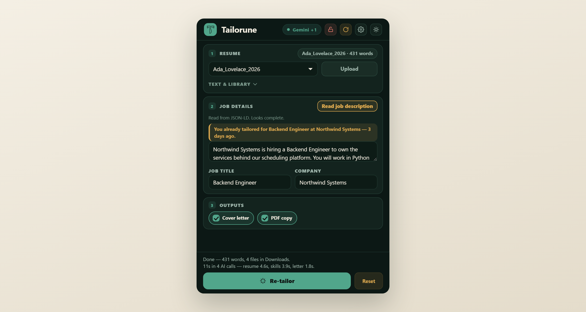
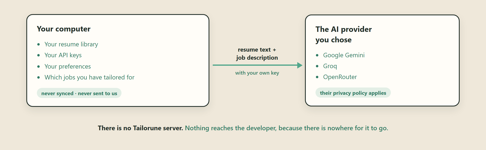

<div align="center">


# Tailorune

**Tailor your resume to a job posting, from inside Chrome.**<br>
No account. No server. Bring your own AI key.

[](https://chromewebstore.google.com/detail/chnibpoikgjckekkgpoeejdnmempllkh)




</div>

---

## What it does

Read the job off the tab you are on, and get a rewritten resume and a matching
cover letter — **without the tool inventing a single thing you did not do.**

Paste or upload a resume (`.txt`, `.docx`, `.pdf`), press **Read job
description** on a posting, then **Tailor**. Four files land in Downloads:

```
Ada_Lovelace_Northwind_Resume_0906.docx
Ada_Lovelace_Northwind_Resume_0906.pdf
Ada_Lovelace_Northwind_Cover_0906.docx
Ada_Lovelace_Northwind_Cover_0906.pdf
```

Named that way because applicant tracking systems truncate long filenames, and
because three applications in an afternoon otherwise become `resume(1).docx`
and `resume(2).docx`.

### It will not make things up

Your name, contact details, employers, job titles, dates and education are
**locked fields**. They are copied through exactly as you wrote them and never
enter the part of the request the model is allowed to rewrite — only your
summary and the wording of your bullet points change.

That is a mechanism, not a promise. There is also an optional accuracy review
that flags rewrites drifting from your original wording; it is advisory and
never edits or withholds a document.

### Other things it does

| | |
|---|---|
| **Resume library** | Upload once, reuse for every application |
| **Lock a job** | The popup stops following your tabs while you compare postings |
| **Remembers** | Says so when you come back to a posting you already tailored for |
| **Both formats** | `.docx` and `.pdf`, laid out identically |
| **Light and dark** | Follows your system, or pick one |

## Where your data goes

<div align="center">

</div>

The full detail is in [PRIVACY.md](PRIVACY.md), including what is stored, for
how long, and how to clear it.

## Getting started

**1. [Install it](https://chromewebstore.google.com/detail/chnibpoikgjckekkgpoeejdnmempllkh).**
That is the whole installation — no companion app, no local server, nothing to
configure on your machine.

**2. Get a free AI key.** The only fiddly step, and about two minutes.
Tailorune has no server and no model of its own, so it uses yours:

| Provider | Get a key | Free tier |
|---|---|---|
| **Google Gemini** | [aistudio.google.com/apikey](https://aistudio.google.com/apikey) | Yes — no card needed |
| **Groq** | [console.groq.com/keys](https://console.groq.com/keys) | Yes — no card needed. Very fast |
| **OpenRouter** | [openrouter.ai/keys](https://openrouter.ai/keys) | Free models, shared pool, can be busy |

Any one is enough. Sign in, create a key, copy it. The same links are inside
the extension, under the gear.

**3. Paste the key in.** Toolbar icon → the **gear** → **API key**. It is saved
on your machine and never sent anywhere but the provider it belongs to.

> Adding a second provider's key under *fallback keys* is worth the extra
> minute: free tiers rate-limit, and a run that hits a limit rotates to the
> next provider instead of failing.

**4. Add your resume.** **Upload** a `.txt`, `.docx` or `.pdf`, or paste the
text. Press **Save** to keep it in the library so you only do this once.

**5. Tailor.** Open a job posting, click Tailorune, press **Read job
description**, then **Tailor resume**. Four files land in Downloads.

### If something goes wrong

| What you see | What it means |
|---|---|
| **"No key"** in the header | No usable key yet — the gear, step 2 above |
| **Read job description finds nothing** | Some postings load their text late, or sit behind a login. Paste the description in by hand; it works exactly the same |
| **"temporarily unavailable… retry in ~30s"** | Your provider rate-limited you. Add a second provider's key so runs rotate instead of stalling |
| **A run seems stuck** | Runs take roughly 10–20 seconds. The popup closes if you click away and the run keeps going — reopen it and the result will be there |

## Contributing

Issues and pull requests are welcome — [open an
issue](https://github.com/JuanPRG/tailorune/issues) for a bug, a job board that
will not read, or a resume layout that comes out wrong. A failing case is the
most useful thing you can send.

Licence: [MIT](LICENSE). Third-party notices ship inside the extension, in
[`extension/THIRD_PARTY_NOTICES.txt`](extension/THIRD_PARTY_NOTICES.txt).

## Build from source

Only needed to develop it — installing from the store is the normal path.

```bash
npm install
npm run build      # bundles the offscreen engine + vendors pdf.js
```

Then in Chrome: `chrome://extensions` → **Developer mode** → **Load unpacked** →
pick `extension/`.

```bash
npm run test:unit   # pure logic, no browser
npm run test:e2e    # real Chromium, real unpacked extension
npm test            # both
npm run package     # dist/tailorune-<version>.zip
```

The e2e suite drives a real unpacked extension and makes real
`chrome.downloads` calls. It runs one file at a time on purpose: browser-action
popups are destroyed on focus loss, so two browsers competing for OS focus kill
each other's popups. LLM calls are answered by a local mock server rather than
network interception — `context.route()` does not intercept fetches made from
an offscreen document, which is documented nowhere and cost an afternoon to
find out. See [`tests/e2e/mockLlmServer.mjs`](tests/e2e/mockLlmServer.mjs).

[`docs/STORE_SUBMISSION.md`](docs/STORE_SUBMISSION.md) has the permission
justifications and the pre-upload checklist.
