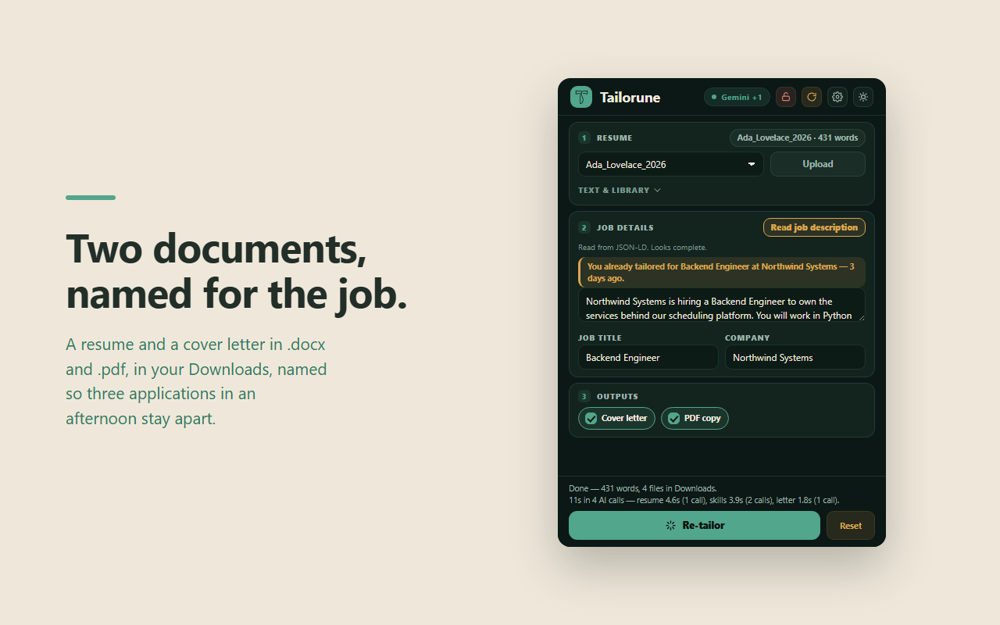

# Tailorune

**Tailor your resume to a job posting, from inside Chrome. No account, no server.**

Read the job off the tab you are on, and get a rewritten resume and a matching cover letter —
as `.docx` and `.pdf`, named for the employer and the day — without the tool inventing a single
thing you did not do.



- **Privacy:** [PRIVACY.md](PRIVACY.md) · **Licence:** [MIT](LICENSE)
- Third-party notices ship inside the extension:
  [`extension/THIRD_PARTY_NOTICES.txt`](extension/THIRD_PARTY_NOTICES.txt)

---

## What it does

Paste or upload a resume (`.txt`, `.docx`, `.pdf`), press **Read job description** on a posting,
then **Tailor**. Four files land in Downloads:

```
Ada_Lovelace_Northwind_Resume_0906.docx
Ada_Lovelace_Northwind_Resume_0906.pdf
Ada_Lovelace_Northwind_Cover_0906.docx
Ada_Lovelace_Northwind_Cover_0906.pdf
```

Named that way because applicant tracking systems truncate long filenames, and because three
applications in an afternoon otherwise become `resume(1).docx` and `resume(2).docx`.

- **Lock a job** so the popup stops following your tabs while you compare postings.
- **It remembers what you already tailored for** and says so when you come back to a posting.
- **Autofill is deliberately out of scope**, which is why this extension declares no content
  scripts and no broad host access at all.

## The parts that were actually hard

Most of this project is not the AI call. It is everything around it.

**The PDF and the DOCX have to be the same document.** Word renders Arial; a PDF library does
not have Arial and may not redistribute it. Arimo is Arial's metric-compatible twin, but
"metric-compatible" is a marketing phrase until you check it — so
[`fontMetrics.test.mjs`](tests/unit/fontMetrics.test.mjs) measures **every advance width** against
a real `arial.ttf` and requires them *identical*, not close. The faces are then subset to the
Latin ranges a resume can actually reach, which drops ~80% of the bytes and changes no metric of
any glyph kept.

**Three renderers, kept in parity.** DOCX, PDF and HTML each lay out the same resume, and
[`render-parity.test.mjs`](tests/e2e/render-parity.test.mjs) converts the DOCX through LibreOffice
and asserts all three agree on how tall the same words are and whether a long resume still fits on
one page. Layout decisions live in one shared module so parity is structural, not maintained by
copying.

**The model structurally cannot fabricate an employer.** `resumeModel.js` splits the resume into
locked fields — name, contact, every entry's title, dates, education — and editable ones, the
summary and bullet wording. Locked fields are copied through verbatim and never enter the part of
the prompt the model may rewrite. There is an optional second-opinion pass that flags rewrites
drifting from your original wording; it is advisory and never withholds a document.

**MV3 fights you on long work.** A service worker gets ~5 minutes per event, and a full run is
several sequential model calls plus two document renders. The pipeline lives in an
[offscreen document](extension/offscreen/offscreen.entry.js), which has no such ceiling. The
browser-action popup is also destroyed the moment it loses focus — so every piece of state that
matters is persisted, and a run is guarded in the service worker rather than in the popup, because
the popup will not be there when the run finishes.

**462 tests, and the e2e ones drive a real extension.** Real Chromium, real unpacked extension,
real `chrome.downloads` calls, real files read back off disk. They run **one file at a time** on
purpose: they drive genuine browser-action popups, and two browsers competing for OS focus kill
each other's popups. Measured, same commit: 47 pass / 4 spurious failures in parallel, versus a
clean run serially.

## Where your data goes

Saved **on your machine**: your resume library, your API keys, your preferences, and the list of
jobs you have tailored for. None of it is synced, and none of it reaches the developer — there is
no server to reach.

**Sent out:** your resume text and the job description go to the AI provider you chose (Gemini,
Groq, or OpenRouter), authenticated with your own key. That provider's privacy policy then
applies. That is the one thing that leaves your machine, and [PRIVACY.md](PRIVACY.md) says so in
full.

## Install

From the Chrome Web Store — or from source:

```bash
npm install
npm run build      # bundles the offscreen engine + vendors pdf.js
```

Then in Chrome: `chrome://extensions` → **Developer mode** → **Load unpacked** → pick `extension/`.

Add your resume, add a key under the gear, press **Tailor resume**. Gemini and Groq both have free
tiers that need no card.

## Develop

```bash
npm run test:unit   # pure logic, no browser
npm run test:e2e    # real Chromium, real unpacked extension
npm test            # both
npm run package     # dist/tailorune-<version>.zip
```

LLM calls in e2e are answered by a local mock HTTP server rather than network interception —
`context.route()` does not intercept fetches made from an offscreen document, which is not
documented anywhere and cost an afternoon to discover. See
[`tests/e2e/mockLlmServer.mjs`](tests/e2e/mockLlmServer.mjs).

[`docs/STORE_SUBMISSION.md`](docs/STORE_SUBMISSION.md) has the permission justifications and the
pre-upload checklist.

## Internal notes

The files below are engineering scratch, not user documentation, and are **not kept in sync** with
the shipped product — the code and its comments are the source of truth.

- [`docs/STATUS.md`](docs/STATUS.md) — what was built, against the plan.
- [`docs/MIGRATION_PLAN.md`](docs/MIGRATION_PLAN.md) — architecture decisions and honest losses.
- [`docs/SPIKE_FINDINGS.md`](docs/SPIKE_FINDINGS.md) — the measurements behind them: Unicode
  fidelity across PDF generators, MV3 CSP compatibility, ATS vendor documentation.
